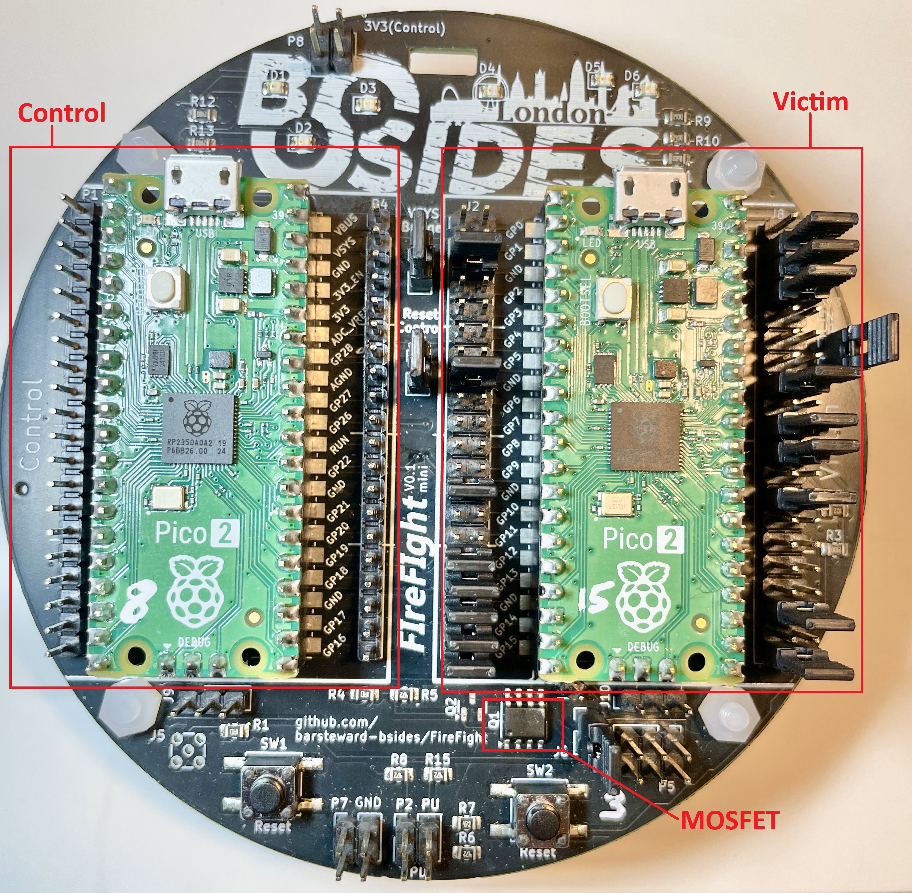
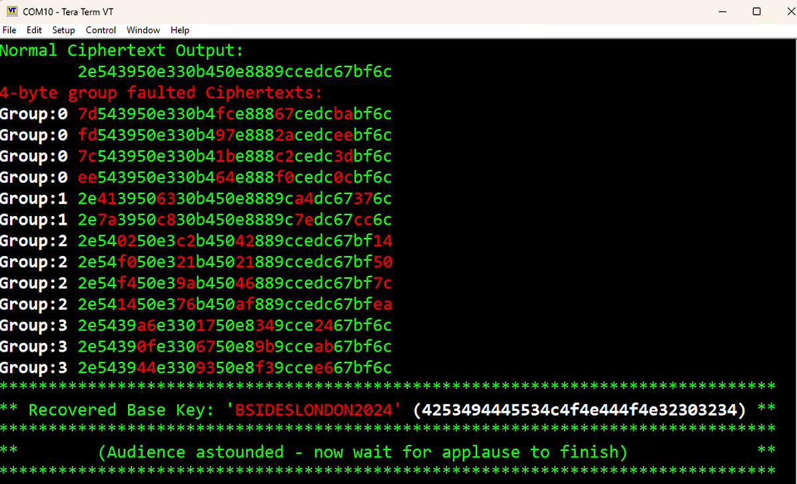

## FIreFIght
FIreFIght is a project put together for a Fault Injection demo during a [BSides London](https://bsides.london/) 2024 talk, by @barsteward.bsky.social
 * [Talk outline](https://cfp.securitybsides.org.uk/bsides-london-2024/talk/EHRQSN/)
### Presentation
 * Presentation [PowerPoint](/Presentation/Roll%20your%20own%20vulnerabilities%20V1.0.pptx)
 * Roll your own vulnerabilities [Slides PDF](/Presentation/Roll%20your%20own%20vulnerabilities%20V1.0.pdf)
 * Roll your own vulnerabilities [Notes PDF](/Presentation/Roll%20your%20own%20vulnerabilities%20V1.0%20Notes.pdf)
## Voltage Fault Injection: Differential Fault Analysis Demo
The demo consists of a PCB, the "FIreFIght Mini V0.1", which houses two Raspberry Pi Pico 2 boards. One board acts as the "Control" interface, setting itself up as a USB-CDC port to talk to a host PC, and the other is the "Victim". The Control board uses a MOSFET to perform voltage fault injection on the Victim, during an AES-128 encryption operation. This causes the encryption operation to generate faulty ciphertexts, which are then analysed in order to perform key recovery.
## Prior art and dependencies
This is NOT a new attack and it heavily relies upon open source libraries such as PhoenixAES by @Doegox
I made minor modifications made to PhoenixAES and aeskeyschedule libraries to get them to run in uPython on the Pico 2
* DFA Key recovery library phoenixAES: Philippe Teuwen @doegox 
  https://github.com/SideChannelMarvels/JeanGrey/tree/master/phoenixAES
  * Branched for uPython tweaks: https://github.com/barsteward-bsides/JeanGrey/tree/master/phoenixAES
* AES key schedule library aeskeyschedule: Marcel Nageler @fanoster
  https://github.com/fanosta/aeskeyschedule
  branched for uPython tweaks: https://github.com/barsteward-bsides/aeskeyschedule_micropython/tree/master/aeskeyschedule
## Code
### Control
This is released under GNU GENERAL PUBLIC LICENSE Version 3
## PCB Design Files
* Gerber Please see the [pcb/Gerber](/pcb/gerber) folder 
* [Schematic] (/pcb/FireFightmini_Schematic_V01.pdf)

## Ordering the FIreFIght Mini PCB
Please see the [PCB readme](/pcb/ReadMe.md)

## Configuring the PCB
The FIreFIght board holds 2 Pi Pico2 boards, one referred to as the "Control" (on the left side), and one referred to as the "Victim" (On the right hand side)  
* Solder the two 20-pin headers pins on the underside of both Pico2 boards (or buy Pico2 H when available).  
* Place solder blob on Victim Pico TP7 (Lowest test point on underside of board, unlabelled, with 2 small holes).  
* Solder flying wire to TP7 - best to run this along the board and superglue it too, to avoid placing stress on TP7 during the next steps.  
* When the glue is dry, insert both Pico2 boards into the FIreFIght Mini boards, taking care to route the wire from victim TP7 carefully through PCB cut-out immediately below it, and making sure to place the usb port at the top of the PCB, near the BSides logo.  
* Solder the flying wire from victim TP7 to the large rectangular pad on the underside of the Firefight PCB, just below the cut-out.  
* Check or populate the jumpers as follows: * indicates fitted jumper.  

___________________________
J2 Left side of Victim Pico. (Left side is odd header pins numbers, right side is even):
___________________________
 J2.1-2:   "GP0" Do not fit  
 J2.3-4:   "GP1" Do not fit  
*J2.5-6:   "GND" Fit Jumper  
 J2.7-8:   "GP2" Do not fit  
 J2.9-10:  "GP3" Do not fit  

 J2.11-12: "GP4" Do not fit  
 J2.13-14: "GP5" Do not fit  
*J2.15-16: "GND" Fit Jumper  
 J2.17-18: "GP6" Do not fit  
 J2.19-20: "GP7" Do not fit  

 J2.21-22: "GP8"  Do not fit  
 J2.23-24: "GP9"  Do not fit  
*J2.25-26: "GND"  Fit Jumper  
 J2.27-28: "GP10" Do not fit  
 J2.29-30: "GP11" Do not fit  

*J2.31-32: "GP12" Fit Jumper (Connects Victim UART0 Tx to Control UART0 Rx)  
*J2.33-34: "GP13" Fit Jumper (Connects Victim UART0 Rx to Control UART0 Tx)  
*J2.35-36: "GND"  Fit Jumper  
*J2.37-38: "GP14" Fit Jumper (GP14 Red LED)  
*J2.39-40: "GP15" Fit Jumper (GP15 Green LED)  

___________________________
J8 (Left side is odd header pins numbers, right side is even):
___________________________
J8.1-2:   "VBUS"     Do not fit  
*J8.3-4:   "VSYS"     Fit Jumper (Connects Victim VSYS to Control VSYS, via VSYS Bridge Jumper)  
*J8.5-6:   "GND"      Fit Jumper  
*J8.7-8:   "3V3_EN"   Fit Jumper (Connects Control GP20, via J1, to Victim 3V3_EN)  
 J8.9-10:  "3V3"      Do not fit  

 J8.11-12: "ADC_VREF" Do not fit   
 J8.13-14: "GP28"     Do not fit  
*J8.15-16: "AGND"     Fit Jumper  
 J8.17-18: "GP27"     Do not fit  
*J8.19-20: "GP26"     Fit Jumper (Victim Trigger, connects Victim GP26 to Control GP26)  

*J8.21-22: "RUN"      Fit jumper (Connects Control GP22 to Victim RUN)  
 J8.23-24: "GP22"     Do not fit  
*J8.25-26: "GND"      Fit jumper  
 J8.27-28: "GP21"     Do not fit  
 J8.29-30: "GP20"     Do not fit  

 J8.31-32: "GP19"     Do not fit  
 J8.33-34: "GP18"     Do not fit  
*J8.35-36: "GND"      Fit jumper  
 J8.37-38: "GP17"     Do not fit  
*J8.39-40: "GP16"     Fit jumper (Connects Victim GP16 to Blue LED)  

__________________________
Other Jumpers
___________________________
*J1: "3V3 EN"        Will Fit Jumper later, after programming Victim (Connects Control GP20 to Victim )  
*J3  "Reset Control" Fit Jumper (Connects Control GP22 to Victim RUN)                                                                                                    
*J4: "VSYS Bridge"   Fit Jumper (Connects Control VSYS to Victim VSYS)  
*J6: "J6"            Fit Jumper (Connects MOSFET output to pad on back of PCB, which should be connected to Victim TP7)  

## Programming the Pi Pico 2 boards
### Control Pi
 * Install the uPython interpreter: https://micropython.org/resources/firmware/RPI_PICO2-20241129-v1.24.1.uf2 
 * Copy [/Code/Control/main.py](/Code/Control/main.py) to /pyboard/main.py on the Control Pico 2 (I use rshell for this)
 * Copy the contents of [/phoenixAES](https://github.com/barsteward-bsides/JeanGrey/tree/master/phoenixAES/phoenixAES) -the version from  this repo - to /pyboard/phoenixAES/
 * Copy the contents of [/aeskeyschedule](https://github.com/barsteward-bsides/aeskeyschedule_micropython/tree/master/aeskeyschedule) -the version from  this repo - to /pyboard/aeskeyschedule/
 * After a reset (using the reset button on the PCB below the Control Pi), the green LED on the Control PI Pico 2 should begin flashing
### Victim Pi
* Before installing in the PCB, plug the Victim Pi Pico 2 into a host PC (or if already installed, ensure that the J1:3V3 EN jumper is removed)
* Copy [/Code/Victim/SW_AES.uf2](/Code/Victim/SW_AES.uf2) to the Pi Pico 2
## Running the demo
* Plug in the USB cable to the Control Pi Pico 2
* Open a serial terminal, such as TeraTerm, and open the serial port that appears when the Control Pi is plugged in
  * Recommended Terminal settings: 120 characters wide, Local Echo, Receive: CR line ending, Transmit CR line ending
* Type '?' for a list of commands
* Type 'x' to execute the DFA attack demo and follow onscreen instructions

