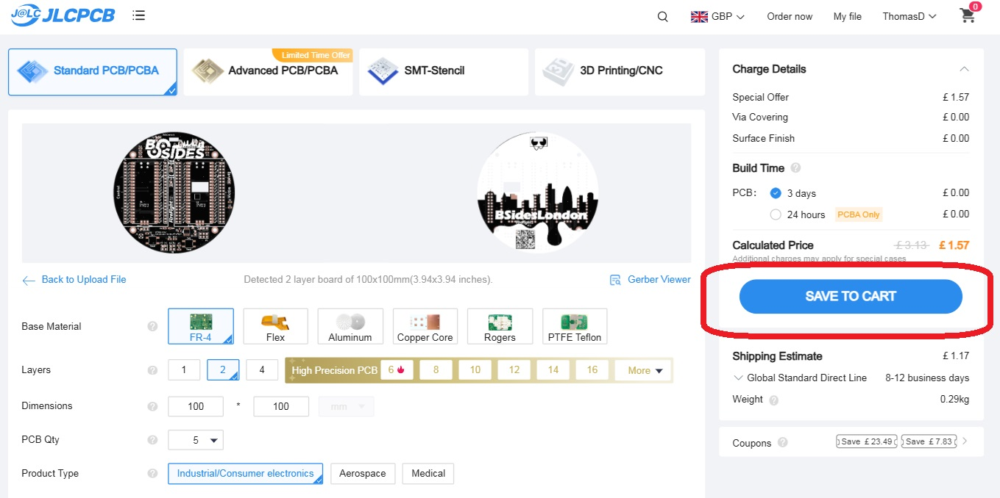
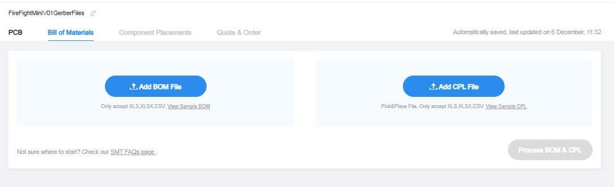

## Ordering Printed Circuit Board (PCB)

The pcb of FireFight mini V0.1 was manufactured by a Chinese low-cost pcb vendor, [JLCPCB](https://jlcpcb.com/ "JLCPCB").

JLCPCB offers to:
* manufacture the printed circuit board itself
* manufacture the printed circuit board including sourcing and assembly of the parts

Below is description how to order FireFight mini boards from JLCPCB.

### Ordering PCB without assembly

If you feel comfortable to solder the FireFight mini board by yourself, then the most cost effective solution might be to just order the PCBs itself.

For that do the following:
1) Drag and drop the [FireFight gerber files](/pcb/gerber/BsidFireFightMiniV01GerberFiles.zip) into the "Add gerber file" box on the main JLCPCB page [JLCPCB](https://jlcpcb.com/ "JLCPCB")

    

2) Make your choices regarding your pcb

   You have some choices for your pcb production. This may influence the price and production time of your pcb.

   Following choices are recommended:
   * You may want the surface finish to be lead free. To do so, select "LeadFree HASL" under "Surface Finish" in the "PCB Specifications" section.
   * JCLPCB may put some production code (silkscreen) onto your pcb. You may want them not to do so by selecting "Remove Mark" under "Mark on PCB" in the "High-spec options".

3) Click the SAVE TO CART button

   Simply click the "SAVE TO CART" button. It is possible to select the shipping method already here, but on the next page you have more detailed description about shipping options.

     

4) View your cart and select the item to be ordered and press the "SECURE CHECKOUT" button

     

5) Select the Shipping option

   If you have some patience you can select the "Global Standard Direct Line".
   

6) Finalize your order
   
   Finally you may submit and pay your order.

### Ordering PCB with assembly

For ordering assembled pcbs, you may follow the initial steps of the "Ordering PCB without assembly" paragraph. In addition you have to:
1) Activate the "Assembly" slide
   

2) Make your choices and click "NEXT" buttons until you can upload your "Bill of Materials"

    

    Drag and drop the [FireFightMiniV01-BOM_JLCSMT.xlsx](assembly/FireFightMiniV01-BOM_JLCSMT.xlsx") and the [FireFightMiniV01-CPL_JLCSMT.xlsx](assembly/FireFightMiniV01-CPL_JLCSMT.xlsx") into the corresponding boxes. 

    Then click the "Process BOM & CPL" button.
    

    If all parts are available and you are happy with them, you can click "NEXT". Otherwise you can change the contents of the BOM and CPL files. It would be also possible to just let assemble the pcb partly to save some cost.

3) Confirm the placement of the parts and click "NEXT"

    

4) Give it a "Product Description" and save to cart

    

5) Finalize your order

### Shipping and TAXes

Again be careful which shipping option you select when ordering with JLCPCB. There are some which **do not include all fees (TAXes) and you might be charged by the courier later!!!**.

